# System Architecture

**Interactive Story Platform - Modular Architecture**

This document describes the system architecture after refactoring from monolithic to modular design.

**Version:** 0.1.0
**Last Updated:** 2025-01-04
**Status:** 🟢 Core Modules Complete

---

## Table of Contents

1. [High-Level Overview](#high-level-overview)
2. [Module Architecture](#module-architecture)
3. [API Architecture](#api-architecture)
4. [Data Flow](#data-flow)
5. [Class Diagrams](#class-diagrams)
6. [Deployment Architecture](#deployment-architecture)
7. [Technology Stack](#technology-stack)

---

## High-Level Overview

### System Context Diagram

```mermaid
graph TB
    User[👤 User/Browser]
    Server[🖥️ Node.js Server]
    GeminiText[🤖 Gemini 2.0 Flash<br/>Text Generation]
    GeminiVideo[🎥 Veo 3.1<br/>Video Generation]

    User -->|HTTP Requests| Server
    Server -->|Story/Scene Generation| GeminiText
    Server -->|Video Generation| GeminiVideo
    Server -->|HTTP Responses| User

    style User fill:#e1f5ff
    style Server fill:#fff4e1
    style GeminiText fill:#e8f5e9
    style GeminiVideo fill:#fce4ec
```



### Architecture Evolution


**Impact:**
- 53% reduction in server.js size
- Improved testability (16 new tests)
- Better separation of concerns
- Easier maintenance and extension

---

## Module Architecture

### Module Dependency Graph


### Module Responsibilities


---

## API Architecture

### Endpoint Structure


### API Request Flow - Story Generation


### API Request Flow - Video Generation


---

## Data Flow

### Story Generation Data Flow


### Video Generation Data Flow


---

## Class Diagrams

### StoryGenerator Class


### VideoGenerator Class


### Module Integration


---

## Deployment Architecture

### Local Development


### Production Deployment (Future)


---

## Technology Stack

### Current Stack


### Dependencies

| Package | Version | Purpose |
|---------|---------|---------|
| express | ^4.18.2 | Web server framework |
| cors | ^2.8.5 | Cross-origin resource sharing |
| @google/generative-ai | ^0.21.0 | Gemini API client |
| dotenv | ^16.0.3 | Environment variable management |

**Dev Dependencies:**

| Package | Version | Purpose |
|---------|---------|---------|
| nodemon | ^3.0.1 | Auto-restart during development |

---

## Performance Considerations

### Caching Strategy


**Cache Performance:**
- **Cache Hit:** ~0ms (in-memory lookup)
- **Cache Miss:** ~8-15 seconds (full API generation)
- **Cache Size:** Unlimited (in-memory, cleared on restart)
- **Cache Strategy:** By scene ID

### Retry Strategy


**Retry Performance:**
- **Total Max Time:** 3 API attempts + 3 seconds delay = ~27-45 seconds worst case
- **Early Exit:** Non-retryable errors fail immediately
- **Exponential Backoff:** 1s, 2s progression
- **Success Rate:** Improves reliability by ~60%

---

## Security Architecture

### Authentication Flow (Future)


### Content Security


**Content Filtering Applied To:**
1. Character descriptions (input)
2. Story settings (input)
3. Player choices (input)
4. Generated narration (output)
5. Video prompts (output)

---

## Scalability Considerations

### Horizontal Scaling Strategy


**Scaling Recommendations:**
1. **Cache:** Migrate from in-memory to Redis for shared cache
2. **Database:** Add PostgreSQL for story persistence
3. **Load Balancer:** Add nginx or AWS ELB
4. **Sessions:** Implement session management (Redis)
5. **Rate Limiting:** Protect against API abuse

---

## Error Handling Architecture

### Error Classification

```mermaid
graph TD
    Error[Error Occurs]

    Type{Error<br/>Type?}

    Auth[Authentication<br/>Error]
    Quota[Quota<br/>Exceeded]
    Network[Network<br/>Error]
    Invalid[Invalid<br/>Request]
    Unknown[Unknown<br/>Error]

    RetryCheck{Retryable?}

    Retry[Retry with<br/>Backoff]

    Fail[Fail Fast<br/>Return Error]

    Placeholder[Return<br/>Placeholder]

    Error --> Type

    Type --> Auth
    Type --> Quota
    Type --> Network
    Type --> Invalid
    Type --> Unknown

    Auth --> Fail
    Quota --> Fail

    Network --> RetryCheck
    Invalid --> RetryCheck
    Unknown --> RetryCheck

    RetryCheck -->|Yes| Retry
    RetryCheck -->|No| Placeholder

    Retry -->|Max Retries| Placeholder

    style Auth fill:#ffcdd2
    style Quota fill:#ffcdd2
    style Fail fill:#f44336
    style Network fill:#fff3e0
    style Invalid fill:#fff3e0
    style Unknown fill:#ffccbc
    style Retry fill:#fff9c4
    style Placeholder fill:#c8e6c9
```

**Error Handling Strategy:**
- **Non-Retryable:** 401, 403, 429 → Fail immediately
- **Retryable:** Network, timeout, 500 → Retry with backoff
- **Fallback:** All failures eventually → Placeholder video
- **User-Facing:** Clear error messages, no stack traces

---

## Future Architecture Vision

### Planned Enhancements

```mermaid
graph TB
    subgraph "Phase 1: Current ✅"
        S1[StoryGenerator Module]
        V1[VideoGenerator Module]
    end

    subgraph "Phase 2: In Progress 🔄"
        CF[ContentFilter Module]
        SV[SceneValidator Module]
    end

    subgraph "Phase 3: Planned 📋"
        AR[API Router Module]
        CM[ConfigManager Module]
        ER[Error Handler Module]
        LM[Logger Module]
    end

    subgraph "Phase 4: Future 🔮"
        DB[Database Layer]
        Auth[Authentication]
        Admin[Admin Dashboard]
        Analytics[Analytics System]
    end

    style S1 fill:#c8e6c9
    style V1 fill:#c8e6c9
    style CF fill:#fff3e0
    style SV fill:#fff3e0
    style AR fill:#e3f2fd
    style CM fill:#e3f2fd
    style ER fill:#e3f2fd
    style LM fill:#e3f2fd
    style DB fill:#f3e5f5
    style Auth fill:#f3e5f5
    style Admin fill:#f3e5f5
    style Analytics fill:#f3e5f5
```

---

## Monitoring and Observability (Future)

### Logging Architecture

```mermaid
graph LR
    subgraph "Application"
        App1[Node Instance 1]
        App2[Node Instance 2]
    end

    subgraph "Logging"
        Logger[Winston Logger]
        Console[Console Transport]
        File[File Transport]
        Cloud[Cloud Transport]
    end

    subgraph "Monitoring"
        Metrics[Prometheus]
        Alerts[Alert Manager]
        Dash[Grafana Dashboard]
    end

    App1 --> Logger
    App2 --> Logger

    Logger --> Console
    Logger --> File
    Logger --> Cloud

    App1 --> Metrics
    App2 --> Metrics

    Metrics --> Alerts
    Metrics --> Dash

    style App1 fill:#c8e6c9
    style App2 fill:#c8e6c9
    style Logger fill:#b3e5fc
    style Console fill:#fff3e0
    style File fill:#fff3e0
    style Cloud fill:#fff3e0
    style Metrics fill:#f48fb1
    style Alerts fill:#ffccbc
    style Dash fill:#ce93d8
```

---

## Related Documentation

- [README-REFACTOR.md](./README-REFACTOR.md) - Refactoring progress
- [CHANGELOG.md](./CHANGELOG.md) - Detailed change history
- [docs/prompt-history.md](./docs/prompt-history.md) - Prompt history
- [README.md](./README.md) - Main project README

---

**Generated with:** [Claude Code](https://claude.com/claude-code)
**Last Updated:** 2025-01-04T23:00:00Z
**Version:** 0.1.0
